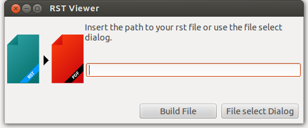
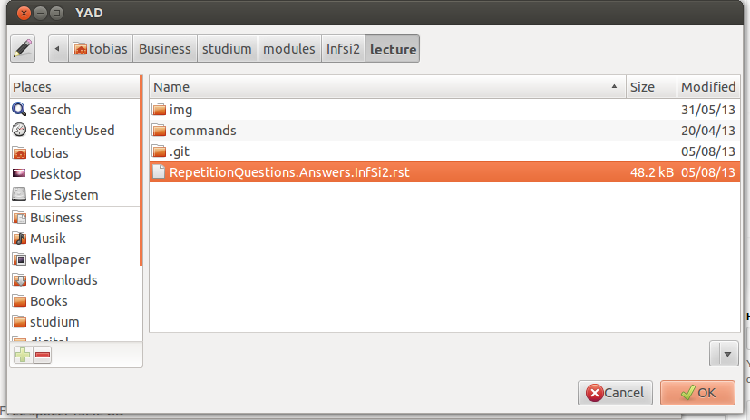

========================
Restructured Text Viewer
========================
Restructured Text Viewer is a bash script, which simulates an rst editor/viewer with yad, rst2pdf, an editor and an pdf viewer.

Author: Tobias Blaser
Version: 1.1

what does it do
---------------
RstViewer opens a given rst file in an editor and shows an build in an pdf viewer. The pdf is be update automatically.

System requirements
-------------------
* rst2pdf installed
* an editor installed
* an pdf viewer installed
* yad installed (only for the graphical dialog, for command line mode not required)

`sudo apt-get install rst2pdf yad`

Installation
------------
Copy the programm folder to /usr/local/bin and the programm launcher rstViewer.desktop in the folder to ~/.local/share/applications

    cd /usr/local/bin
    sudo git clone https://github.com/moonline/rstViewer.git
    cp rstViewer/rstViewer.desktop ~/.local/share/applications/

Usage
-----
* Graphical file selection Dialog: use the launcher to start rstViewer or start it with `sh rstViewer.sh`. You will get a graphical file choose.
* Without graphical Dialog: start rstViewer from command line `sh rstViewer.sh {myRstFile.rst}`. If you use this mode, you won't need yad.

Configuration
-------------
To change the editor or the pdf viewer, copy the configuration file rstViewer.conf to ~/.rstViewer/rstViewer.conf and change it to your preferences.

